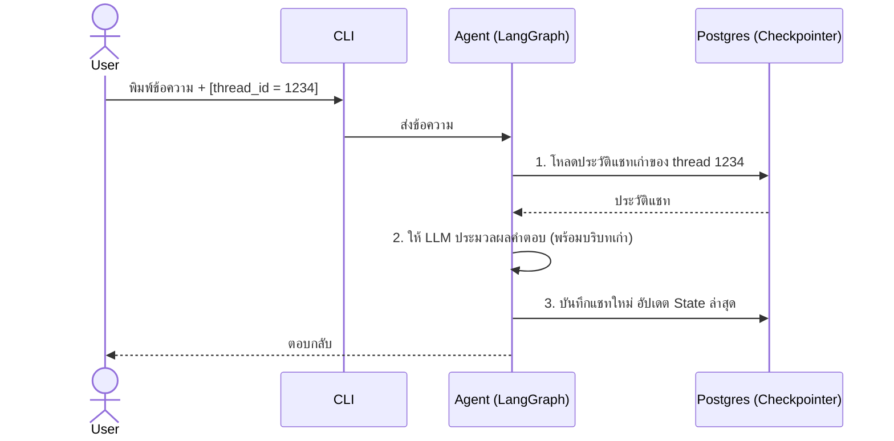

# สถาปัตยกรรมระบบความจำของ AI (POC)

เอกสารนี้สรุปการทำงานของระบบความจำ (Memory) ในโปรเจกต์ Deep Agent + Milvus POC เพื่อใช้สำหรับอธิบายทีมงานให้เห็นภาพรวมของระบบทั้งความจำระยะสั้นและความจำระยะยาว

---

## 1. ความจำระยะสั้น (Short-Term Memory): Checkpointer & Thread ID

### สิ่งที่เปลี่ยนแปลงในโค้ดล่าสุด
- **เพิ่มการรองรับ Postgres:** ระบบถูกปรับให้สามารถบันทึกสถานะการสนทนาลง PostgreSQL ได้ (ผ่านไลบรารี `langgraph-checkpoint-postgres`)
- **เพิ่มการจัดการผ่าน CLI:** เพิ่มคำสั่ง `--thread` เพื่อให้ผู้ใช้ระบุห้องแชทที่ต้องการเชื่อมต่อได้ และคำสั่งย่อยเช่น `/thread`, `/threads`, `/history` เพื่อดูประวัติการสนทนา

### การเรียกใช้ `langgraph-checkpoint-postgres` และจุดประสงค์
- **ใช้ทำอะไร:** โดยปกติ LangGraph จะเก็บสถานะการสนทนา (State) ไว้ใน RAM (`InMemorySaver`) ซึ่งจะ **"ลืม"** ทันทีที่ปิดโปรแกรม การใช้ไลบรารี `langgraph-checkpoint-postgres` จะช่วยเปลี่ยนให้ระบบนำสถานะการสนทนาไปเซฟลง Database อย่างถาวร
- **ผลลัพธ์สุดท้าย:** ผู้ใช้สามารถปิดแอปพลิเคชัน เซิร์ฟเวอร์ล่ม หรือเปิดหน้าต่างใหม่ แล้วเพียงแค่ระบุ `thread_id` เดิม AI ก็จะสามารถดึงประวัติการสนทนาเก่าขึ้นมาตอบโต้ได้อย่างต่อเนื่อง (Persistence) และรองรับการสเกลระบบที่มีผู้ใช้หลายคน (Multi-tenant)

### Diagram: การไหลของข้อมูล Checkpointer



---

## 2. ความจำระยะยาว (Long-Term Memory): Milvus Store & การจัดการ Path

### การจัดการ Connection (URL) ในโปรเจกต์
- การตั้งค่า (URL, Port) จะถูกระบุในไฟล์ `.env` เช่น `MILVUS_DB_URI=http://localhost:19531`
- โค้ดส่วน Agent จะ **ไม่ได้รับรู้ถึง URL นี้โดยตรง** เพื่อคงความเป็น Abstraction 
- ผู้ที่ถือ URL และรับผิดชอบการเชื่อมต่อ (Connection) คือคลาส `MilvusStore` (ใช้ `pymilvus`) เพียงคนเดียว

### กลไกการ Mapping และ Routing (`create_deep_agent`)
- ในฟังก์ชัน `build_agent` มีการเรียกใช้ Helper function ที่ชื่อว่า `create_milvus_memory()` 
- ฟังก์ชันนี้จะสร้าง **"ตำรวจจราจร"** ที่เรียกว่า `CompositeBackend` ขึ้นมา
- `CompositeBackend` ทำหน้าที่จำลอง Virtual File System ให้ AI ใช้งาน โดยมีกฎว่า:
  - หาก AI ร้องขอการอ่าน/เขียนไฟล์ใน Path ที่ขึ้นต้นด้วย `"/memories/"` ให้ส่งงานต่อไปที่ `MilvusStore`
  - หากเป็น Path อื่นๆ ให้ส่งงานไปที่ `StateBackend` (RAM ชั่วคราว)

### การเอา Data ยัดลง Milvus
- เมื่อ AI ต้องการจำข้อมูลถาวร มันจะใช้ Tool `write_file` หรือ `edit_file` ไปที่ `/memories/AGENTS.md`
- `CompositeBackend` ตัดคำว่า `/memories` ออก แล้วส่งคำสั่งพร้อมเนื้อหาไฟล์ไปให้ `MilvusStore`
- `MilvusStore` จะเรียกใช้ Embedding Model แปลงข้อความ (Text) เป็นตัวเลข (Vector) แล้วทำคำสั่ง `upsert` ลง Milvus Database ทันที

### Diagram: การจัดการ Path และการบันทึกลง Milvus

```mermaid
flowchart TD
    A[Agent (AI)] -->|1. เรียก Tool: write_file<br>Path: /memories/AGENTS.md| B(CompositeBackend <br> ตัวแยกเส้นทาง)
    B -->|2. เช็ค Path: ขึ้นต้นด้วย /memories/| C[StoreBackend]
    B -->|เช็ค Path: ชื่ออื่นๆ เช่น /scratch/| D[StateBackend]
    C -->|3. ตัดคำนำหน้าเหลือ /AGENTS.md<br>ส่งต่อให้ MilvusStore| E[MilvusStore]
    E -->|4. แปลง Text เป็น Vector| F[(Milvus Database)]
    D -->|บันทึกชั่วคราวทิ้งเมื่อจบเซสชั่น| G[(RAM / Checkpointer)]
    
    style B fill:#f9f,stroke:#333,stroke-width:2px
    style F fill:#85c1e9,stroke:#333,stroke-width:2px
```

---

## สรุปการเชื่อมโยงระบบ (Overview)

ในขณะที่ **Checkpointer** ทำหน้าที่จำว่า *"เมื่อ 5 นาทีที่แล้วเราคุยอะไรกันไปบ้าง"* เพื่อให้คุยรู้เรื่อง 
ตัว **Milvus Store** จะทำหน้าที่จำว่า *"User คนนี้คือใคร มีความชอบอะไร (User Profile)"* โดย AI จะดึงข้อมูลจาก Milvus มาอ่านก่อนเริ่มการตอบแชททุกครั้ง ทำให้ระบบมีความจำทั้งแบบระยะสั้นและระยะยาวทำงานสอดประสานกันอย่างสมบูรณ์
