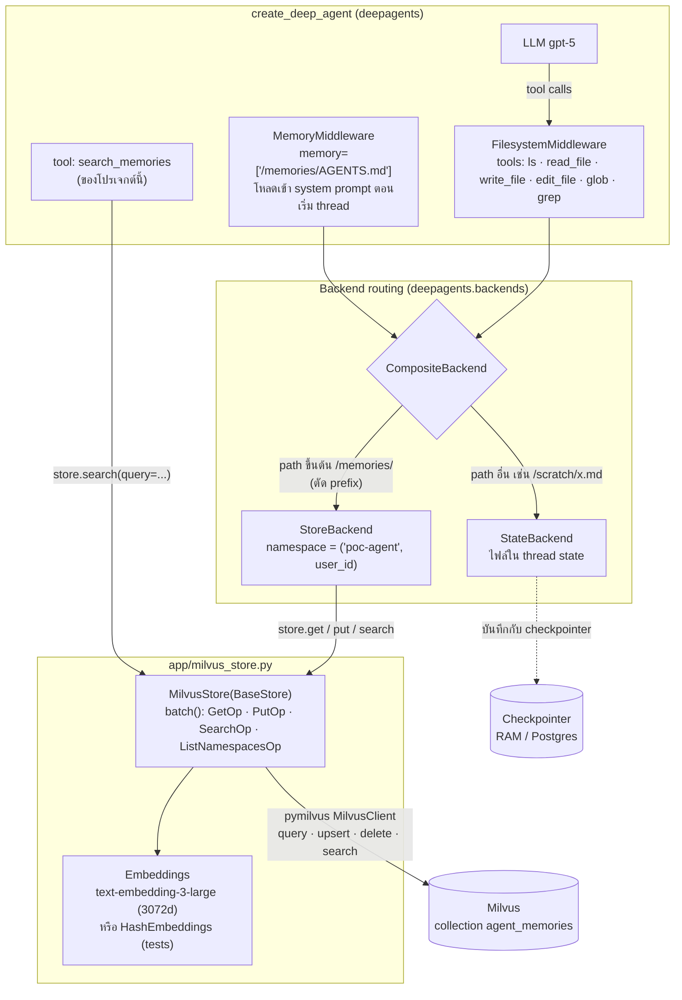
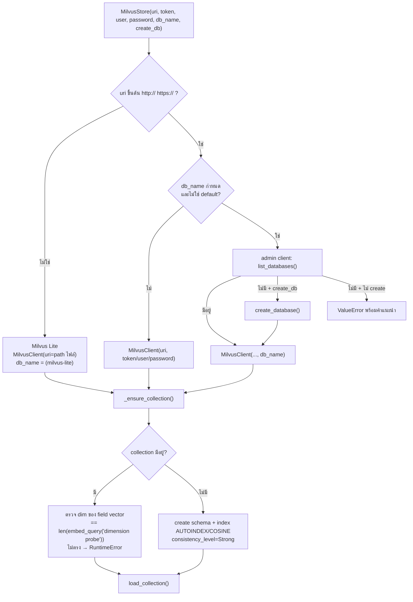
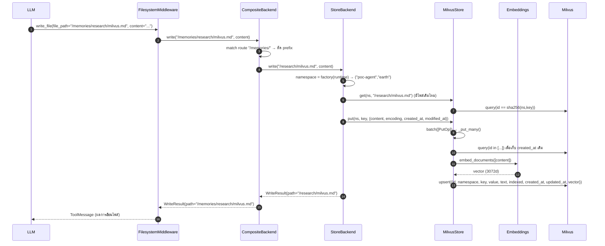
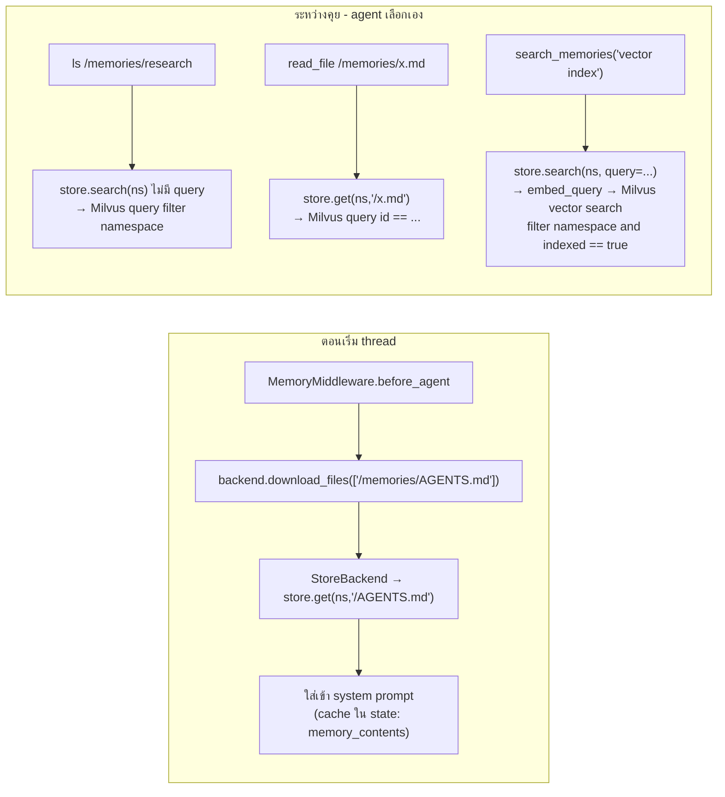

# Milvus Store — memory ของ `create_deep_agent` ลง Milvus ได้ยังไง

> ไฟล์ที่ agent เขียนใต้ **`/memories/`** = 1 row ใน Milvus collection `agent_memories`
> ทุกอย่างอื่น (`/scratch/...`, messages) อยู่ใน state ของ thread (ดู `CHECKPOINTER_AND_THREAD_ID.md`)

---

## 1. TL;DR

| คำถาม | คำตอบ |
|---|---|
| Deep Agents คุยกับ Milvus ตรงๆ ไหม | **ไม่** — Deep Agents รู้จักแค่ `BaseStore` ของ LangGraph เราจึงเขียน **`MilvusStore(BaseStore)`** (`app/milvus_store.py`) เป็นตัวแปล |
| ต่อ Milvus ยังไง | `MilvusStore(uri=...)` — path ไฟล์ = Milvus Lite, `http(s)://` = Milvus server/Zilliz Cloud (+ token / user,password / db_name) |
| agent รู้ได้ยังไงว่าไฟล์ไหนต้องไป Milvus | `CompositeBackend(routes={"/memories/": StoreBackend(...)})` — path ขึ้นต้น `/memories/` ถูก route ไป store, ที่เหลือไป `StateBackend` |
| key ที่อยู่ใน Milvus หน้าตาแบบไหน | `CompositeBackend` **ตัด prefix** ออก: `/memories/research/milvus.md` → key `/research/milvus.md` |
| แยก user ยังไง | `namespace = ("poc-agent", user_id)` → เก็บเป็น string `poc-agent.earth` |
| data ถูกยัดลงยังไง | `write_file` → `StoreBackend.write` → `store.put()` → `MilvusStore.batch([PutOp])` → embed content → `client.upsert()` |
| ค้นหายังไง | ไม่มี query → scalar filter ตาม namespace · มี query → vector search (COSINE) + filter namespace |
| ใช้ในโค้ดทีม | `mem = create_milvus_memory(uri=..., namespace=...)` → `create_deep_agent(..., **mem.agent_kwargs())` |

---

## 2. ภาพรวม (layers)



---

## 3. Connection: URI → Milvus

`MilvusStore.__init__` (`app/milvus_store.py`) — ค่ามาจาก `.env` ผ่าน `make_store()` (`app/agent.py`)

| `.env` | ความหมาย |
|---|---|
| `MILVUS_DB_URI` | `./data/milvus_memory.db` (Lite) · `http://localhost:19531` (Docker ของเรา) · `https://xxx.zillizcloud.com` |
| `MILVUS_DB_TOKEN` | `user:password` หรือ API key |
| `MILVUS_DB_USER` / `MILVUS_DB_PASSWORD` | ทางเลือกแทน token |
| `MILVUS_DB_NAME` / `MILVUS_DB_CREATE` | database (server เท่านั้น) / สร้างให้ถ้าไม่มี |
| `MILVUS_COLLECTION` | ชื่อ collection (default `agent_memories`) |

> ชื่อต้องเป็น `MILVUS_DB_URI` ไม่ใช่ `MILVUS_URI` — pymilvus อ่าน `MILVUS_URI` เองตอน import และรับเฉพาะ `http(s)://` (เคยทำให้ import พังทั้งโปรเจกต์)



ต่อไม่ได้ → `ConnectionError("Cannot connect to Milvus at ... (db=...)")`

### Schema ของ collection

| field | type | ตัวอย่าง | ใช้ทำอะไร |
|---|---|---|---|
| `id` | VARCHAR(64) **PK** | `sha256(["poc-agent","earth"], "/AGENTS.md")` | id คงที่ต่อ namespace+key → `put` ซ้ำ = **upsert** |
| `namespace` | VARCHAR | `poc-agent.earth` | แยก user (join ด้วย `.` เพราะ LangGraph ห้ามมี `.` ใน namespace) |
| `key` | VARCHAR | `/research/milvus.md` | path หลังตัด `/memories` |
| `value` | JSON | `{"content": "...", "encoding": "utf-8", "created_at": "...", "modified_at": "..."}` | ข้อมูลไฟล์ตามรูปแบบของ `StoreBackend` |
| `text` | VARCHAR | เนื้อหาที่ใช้ embed (ตัดที่ 16,000 ตัวอักษร) | debug / ดูใน Attu |
| `indexed` | BOOL | `true` | `put(..., index=False)` → ไม่ถูก vector search |
| `created_at` / `updated_at` | INT64 (ms) | `1789539109055` | created คงเดิมเวลา update |
| `vector` | FLOAT_VECTOR(3072) | embedding ของ `text` | semantic search (AUTOINDEX, COSINE) |

---

## 4. Path matching: `/memories/...` ไปเป็น row ได้ยังไง

`create_milvus_memory()` (`app/milvus_memory.py`) ประกอบของให้:

```python
mem = create_milvus_memory(uri=..., embeddings=..., namespace=("poc-agent", "earth"))
# mem.agent_kwargs() ==
{
  "backend": CompositeBackend(
      default=StateBackend(),
      routes={"/memories/": StoreBackend(namespace=lambda rt: ("poc-agent", "earth"), store=milvus_store)},
  ),
  "store":  milvus_store,                 # store เดียวกับใน StoreBackend (blog ส่ง InMemoryStore() ให้ StoreBackend → ไม่ลง Milvus)
  "memory": ["/memories/AGENTS.md"],      # MemoryMiddleware โหลดไฟล์นี้เข้า prompt
}
```

| agent เรียก | CompositeBackend ส่งไป | key ใน store | ลง Milvus? |
|---|---|---|---|
| `write_file("/memories/AGENTS.md")` | StoreBackend | `/AGENTS.md` | ✅ |
| `write_file("/memories/research/milvus.md")` | StoreBackend | `/research/milvus.md` | ✅ |
| `ls("/memories")` | StoreBackend | `/` (ทั้ง namespace) | อ่าน |
| `write_file("/scratch/notes.md")` | StateBackend | — | ❌ อยู่ใน checkpoint ของ thread |
| `write_file("/memoriesX/a.md")` | StateBackend | — | ❌ (prefix ต้องตรง `/memories/`) |

namespace มาจากไหน:

- **คงที่** (โปรเจกต์นี้): `build_agent(user_id)` → `("poc-agent", user_id)` — ตรวจ user id ด้วย regex (ห้าม `.` `#` ฯลฯ)
- **ต่อ request** (service หลาย user): `namespace=lambda rt: ("my-agent", rt.context["user_id"])` + `invoke(..., context={"user_id": ...})`

---

## 5. Write flow: agent เขียน memory → row ใน Milvus



`edit_file` ทำเหมือนกัน: `get` → แทนข้อความ → `put` (upsert row เดิม, `created_at` คงเดิม)
`delete` → `PutOp(value=None)` → `client.delete(ids=[...])`

---

## 6. Read flow: memory กลับเข้าไปใน agent ได้ 3 ทาง



| store call | Milvus call | หมายเหตุ |
|---|---|---|
| `get(ns, key)` | `query(filter='id == "<sha256>"', limit=1)` | |
| `search(ns)` (ไม่มี query) | `query(filter='namespace == "a.b" or namespace like "a.b.%"')` | กรองซ้ำใน Python ให้ตรง prefix เป๊ะ (`_` ใน LIKE เป็น wildcard) · เรียงตาม namespace, key |
| `search(ns, query=q)` | `search(data=[embed(q)], anns_field="vector", filter=... and indexed == true, metric COSINE)` | คืน `score` |
| `search(ns, filter={...})` | query ตาม namespace แล้วกรอง `value` ใน Python | รองรับ `$eq $ne $gt $gte $lt $lte` |
| `list_namespaces()` | `query(output_fields=["namespace"])` | รองรับ prefix/suffix, `*`, `max_depth` |
| `put(ns, key, value)` | `query` (created_at เดิม) + embed + `upsert` | |
| `delete(ns, key)` | `delete(ids=[...])` | |

`batch()` ใช้ lock เดียวกัน, อ่านก่อนเขียนในแต่ละ batch (พฤติกรรมเดียวกับ `InMemoryStore`), `abatch()` = `asyncio.to_thread(batch)`

---

## 7. ทำไมเชื่อได้ว่าลง Milvus จริง

| หลักฐาน | ที่ไหน |
|---|---|
| Query Milvus ตรงด้วย pymilvus (ไม่ผ่าน adapter) หลัง `put` / หลัง agent `write_file` | `tests/test_milvus_store.py` T1, `tests/test_agent_memory.py` T6 |
| Differential test เทียบผลกับ `InMemoryStore` ของ LangGraph | T3 |
| Agent ใหม่ + client ใหม่ + thread ใหม่ อ่าน memory ได้ | T7 |
| **Negative control**: ลบ row แล้ว agent ไม่รู้ | T8 + live test (gpt-5) |
| `/scratch/...` ไม่ลง Milvus | T10 |
| Store ที่ agent ใช้เป็น `MilvusStore` จริง (กันบั๊กแบบ blog) | T11, `test_milvus_memory.py` |
| helper ต่อด้วย URI ได้ / namespace ต่อ request แยก user ได้ | `tests/test_milvus_memory.py` |
| ดูด้วยตา | `/mem` ใน CLI, `python -m scripts.inspect_memory --user earth [--query ...]`, Attu http://localhost:8000 (หรือพอร์ตที่ตั้งไว้) |

รัน test ทั้งชุดกับ Milvus server:

```bash
MILVUS_TEST_URI=http://localhost:19531 python -m pytest
```

---

## 8. ข้อจำกัด / สิ่งที่ต้องคิดต่อ

- 1 ไฟล์ = 1 vector (ไม่ chunk) · `value` JSON ~64KB ต่อไฟล์ · `text` ตัดที่ 16,000 ตัวอักษร
- `put` ทุกครั้งเรียก embedding API (cost/latency)
- list/search แบบไม่มี query ดึงได้สูงสุด 16,384 rows ต่อครั้ง (ข้อจำกัด Milvus)
- เปลี่ยน embedding model = dim เปลี่ยน → ต้องใช้ collection ใหม่
- ไม่รองรับ TTL
- `raw_rows()` / `count()` / `drop_collection()` เป็น helper สำหรับ demo/test ไม่ใช่ API ของ `BaseStore`
